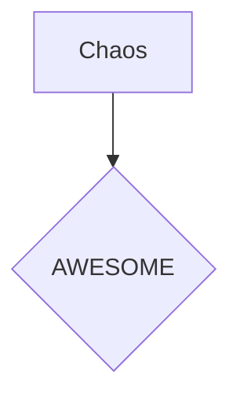

# hello-world
This is for leaning Git.
I study Computer Science in Darmstadt in cooperation with Deutsche Telekom.

LETS Do some awesome things.

```mermaid
graph TD

	Chaos --> AWESOME{"AWESOME"}
```

